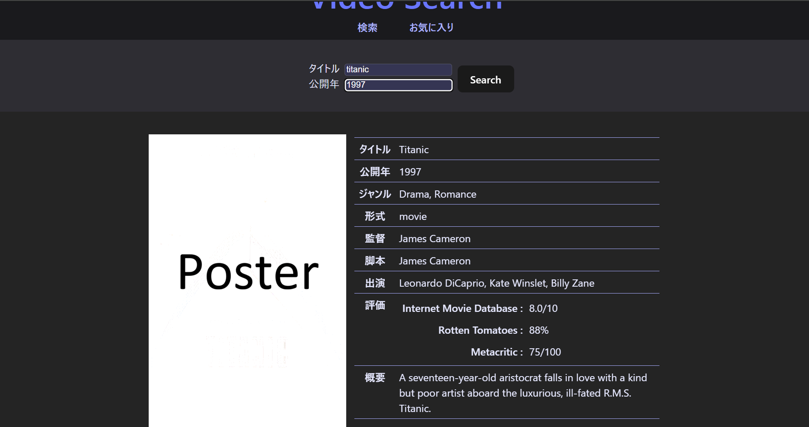

# Film Search App

映画・ドラマの情報を検索できるWebアプリです。

## 機能

- タイトル・公開年で映画・ドラマを検索
- タイトル、公開年、ジャンル、監督、出演者、評価、概要などの詳細情報を表示
- お気に入り登録機能（開発中）

## 使用技術

**フロントエンド**
- React
- React Router
- Vite

**バックエンド**
- Go
- SQLite

**外部API**
- [OMDb API](https://www.omdbapi.com/)

## セットアップ

### 必要なもの

- Node.js
- Go 1.25以上
- OMDb APIキー（[こちら](https://www.omdbapi.com/apikey.aspx)から無料取得可能）

### フロントエンド

```bash
npm install
```

`.env` ファイルをプロジェクトルートに作成し、APIキーを設定してください。

```
VITE_OMDB_API_KEY=your_api_key
```

```bash
npm run dev
```

### バックエンド

今後追加予定

## 画面



## 今後の予定

- [ ] お気に入り機能の実装
- [ ] ポスター画像が取得できない場合のNoImage対応
- [ ] 認証機能の実装
